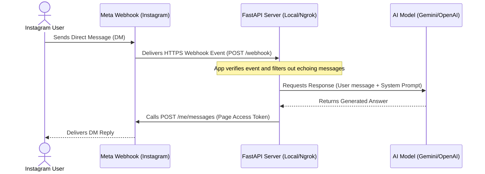

# Instagram Creator AI Auto-Responder 🤖💬

This repository contains a simple, modern, local auto-responder application for real **Instagram Creator or Business accounts** using official Meta Graph APIs and AI models (Google Gemini & OpenAI). 

It features a beautiful, local web interface that lets you configure your environment, manage credentials, adjust system prompts, test simulated webhooks, and view live conversation logs without editing code.

---

## 🗺️ Message Data Flow

This diagram illustrates how a user's DM flows through the Meta API, is processed by this application locally, generated by the AI, and sent back:



---

## 📋 Prerequisites

Before running the launcher, make sure you have:
1. **Python 3.8+** installed. Download from the [Official Python Website](https://www.python.org/downloads/).
   > [!IMPORTANT]
   > During Python installation, make sure to check the box that says **"Add Python to PATH"**.
2. An **Instagram Professional Account** (configured as Creator or Business).
3. A **Facebook Page** (linked directly to the Instagram Account).
4. A **Meta Developer Account** (Free, created using your standard Facebook profile).

---

## ⚡ Quick Start guides

### Windows Setup
1. Open the project folder.
2. Double-click the **[run.bat](file:///c:/Users/RDP/Downloads/instagram-ai-bot/run.bat)** file.
3. The launcher will set up your environment, install requirements, and open `http://localhost:8000` in your browser.

### Android Setup (Termux)
You can run this bot directly on your Android phone using the free **Termux** app:
1. Download and open **Termux** on your Android device.
2. Update packages and install Git and Python by running:
   ```bash
   pkg update && pkg install git python -y
   ```
3. Clone the repository:
   ```bash
   git clone https://github.com/houaidjihoussem-cmyk/instagram-ai-bot.git
   ```
4. Navigate to the project directory:
   ```bash
   cd instagram-ai-bot
   ```
5. Grant execution permission and launch the setup:
   ```bash
   chmod +x run.sh && ./run.sh
   ```
6. Open your mobile browser and go to `http://localhost:8000` to configure the bot.

### macOS & Linux Setup
1. Open your terminal.
2. Clone the repository:
   ```bash
   git clone https://github.com/houaidjihoussem-cmyk/instagram-ai-bot.git
   cd instagram-ai-bot
   ```
3. Grant execution permission and run the launcher:
   ```bash
   chmod +x run.sh && ./run.sh
   ```
4. Open `http://localhost:8000` in your web browser.

---

## 📘 Comprehensive Meta Setup Guide

Connecting your bot to a live Instagram account requires setting up a Developer App in the Meta ecosystem. Follow these steps carefully:

### Phase 1: Convert Account and Link Page
1. **Switch to Professional**: Open Instagram on your mobile device. Go to **Settings and Privacy** -> **Creator/Business tools and controls** -> **Switch to Professional Account**. Choose **Creator** or **Business**.
2. **Enable Message Access (Crucial Mobile Setting)**: In your Instagram mobile app, go to **Settings and Privacy** -> **Messages and Story Replies** -> **Message Controls**. Scroll down to **Connected Tools**, and toggle **"Allow Access to Messages"** to **ON**. Without this, Meta will reject the bot's send requests with an API error.
3. **Create Facebook Page**: If you don't have one, create a basic Facebook Page.
4. **Link Instagram to Page**: Go to your Facebook Page -> **Settings** -> **Linked Accounts** -> **Instagram**. Click **Connect Account** and follow the authorization prompt.

### Phase 2: Create a Facebook Developer App
1. Go to [Meta for Developers](https://developers.facebook.com) and log in.
2. Click **Create App** (top right corner).
3. Choose **Other** -> Click **Next**.
4. Select **Business** as the app type -> Click **Next**.
5. Give your app a name (e.g., `Instagram AI Bot`), choose your contact email, and click **Create App**.

### Phase 3: Add Instagram Graph API & Generate Tokens
1. Inside your new app dashboard, locate **Instagram Graph API** in the list of products and click **Set Up**.
2. Go to the [Meta Graph API Explorer](https://developers.facebook.com/tools/explorer).
3. In the top-right corner under **Meta App**, select the app you just created.
4. Under **User or Page**, select your linked **Facebook Page**.
5. Under **Permissions** (in the right panel), add the following four permissions:
   - `instagram_basic`
   - `instagram_manage_messages`
   - `pages_manage_metadata`
   - `pages_show_list`
6. Click **Generate Access Token**. A Meta prompt will pop up asking you to authorize access to your page.
7. Once generated, click the **Copy icon** next to the Access Token field.
8. **Extend Token Lifetime (Highly Recommended)**: Standard tokens expire in 1-2 hours. To get a 60-day long-lived token:
   - Click the **ⓘ Info** icon next to your token in the Graph Explorer.
   - Click **Open in Access Token Tool**.
   - Click **Extend Access Token** at the bottom of the page, authenticate, and copy the new extended token.
9. Paste this extended token into the **Facebook Page Access Token** field in your local bot dashboard.

### Phase 4: Configure Webhooks
1. Open your local bot dashboard (`http://localhost:8000`).
2. If you are using Ngrok (highly recommended for local development), enter your **Ngrok Authtoken** (see the Ngrok section below) and check the **use_auto_tunnel** option. Click **Save Configurations** and restart the bot.
3. Copy the **Webhook URL** displayed in the dashboard panel (e.g., `https://xxxx.ngrok-free.app/webhook`).
4. Copy the **Verify Token** (e.g., `insta_bot_verify_token_123`).
5. Go back to your [Meta Developer App Dashboard](https://developers.facebook.com).
6. In the left sidebar, click **Instagram** -> **Settings**.
7. Scroll down to the **Webhooks** section and click **Configure**.
8. Paste your public Webhook URL into the **Callback URL** field.
9. Paste your Verify Token into the **Verify Token** field. Click **Verify and Save**.
10. Under Webhooks, click **Manage** (or **Edit**). Look for the **messages** field row and click **Subscribe**.

---

## 🔑 Getting API Keys

### Google Gemini API Key
1. Go to [Google AI Studio](https://aistudio.google.com).
2. Log in with your Google account.
3. Click **Get API Key** in the top left menu.
4. Click **Create API Key** -> Select/create a project -> Copy the key.
5. Paste the key into your local bot dashboard under the Gemini section.

### OpenAI API Key
1. Go to the [OpenAI Developer Platform](https://platform.openai.com).
2. Log in and navigate to **API Keys** in the left menu.
3. Click **Create new secret key**, name it, and copy the key.
4. Paste the key into your local bot dashboard under the OpenAI section.

### Ngrok Authtoken (For Webhook Tunneling)
Since Meta webhooks require a public HTTPS URL, local servers (`http://localhost:8000`) cannot receive events directly. Ngrok acts as a secure public tunnel.
1. Sign up for a free account at [Ngrok](https://ngrok.com).
2. Go to your [Ngrok Dashboard](https://dashboard.ngrok.com).
3. In the left menu under **Getting Started**, click **Your Authtoken**.
4. Copy the authtoken and paste it into the **Ngrok Authtoken** field in the bot settings dashboard. Check the **Automatically start ngrok tunnel on startup** box.

---

## 🛠️ Troubleshooting & FAQ

#### Q: The bot is running and verification succeeded, but it doesn't reply to DMs.
- **Check Access Token Permissions**: Go back to the [Graph API Explorer](https://developers.facebook.com/tools/explorer) and ensure all four scopes (`instagram_basic`, `instagram_manage_messages`, `pages_manage_metadata`, `pages_show_list`) were checked when you generated the token.
- **Webhook Subscription**: Make sure you clicked **Manage** next to the Webhook settings on the Meta App portal and subscribed to the `messages` event.
- **Echo Loop Prevention**: The bot automatically filters out messages where `is_echo` is true to prevent loops. Verify that you are testing the bot by sending a DM from a *different* Instagram account, not by typing in the chat from the Creator account itself.

#### Q: The bot replies with "Gemini API key is missing..." in the logs.
- Make sure you pasted your API key into the dashboard, selected the correct provider (Gemini or OpenAI), and clicked **Save Configurations**. Check your local `.env` file to verify that the credentials were saved correctly.

#### Q: I get a `UnicodeEncodeError` or crash on my Windows terminal.
- The terminal runner in this project is configured to override standard output to `UTF-8` automatically on Windows. If you still encounter crashes, ensure your system supports UTF-8, or try launching the bot directly using the `run.bat` launcher.

---

## ⚠️ Disclaimer

This application is an independent open-source project and is not affiliated, associated, authorized, endorsed by, or in any way officially connected with Meta Platforms, Inc. (Facebook, Instagram), Google LLC, OpenAI, or Ngrok.

- **API Costs**: Integrating third-party APIs (such as Google Gemini, OpenAI, or Ngrok) may incur usage fees depending on your billing tier and transaction volume. You are solely responsible for monitoring and managing your API keys, usage limits, and billing.
- **Account Safety & Policies**: Social media automation is subject to Meta's Developer Terms and Instagram's Community Guidelines. Automated bulk messaging, unsolicited spamming, or violating platform policies can lead to temporary or permanent account suspension, or loss of API access. Use this software responsibly.
- **No Warranty**: This software is provided "as is", without warranty of any kind, express or implied. The author shall not be held liable for any damages or account limitations resulting from the use of this software.
